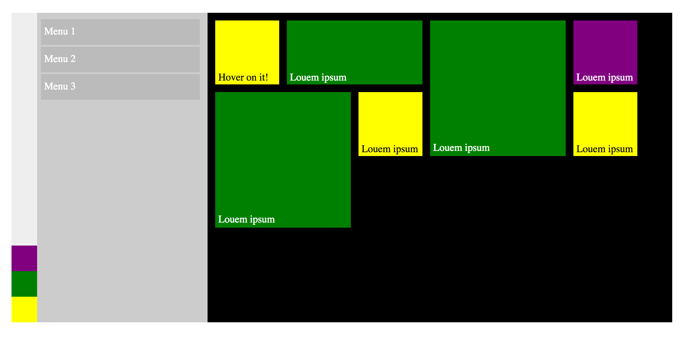

# Metro CSS

Modern CSS with modern start menu!

This project use CSS [grid](https://developer.mozilla.org/en-US/docs/Web/CSS/grid), [flexbox](https://developer.mozilla.org/en-US/docs/Web/CSS/flex) and [transition](https://developer.mozilla.org/en-US/docs/Web/CSS/transition) to simulate a Windows(R) 10 start menu.

*Still need improvement*

## Build and run

``` shell
npm install gulp -g
npm install
gulp serve
```

## Screenshots



## License

MIT

